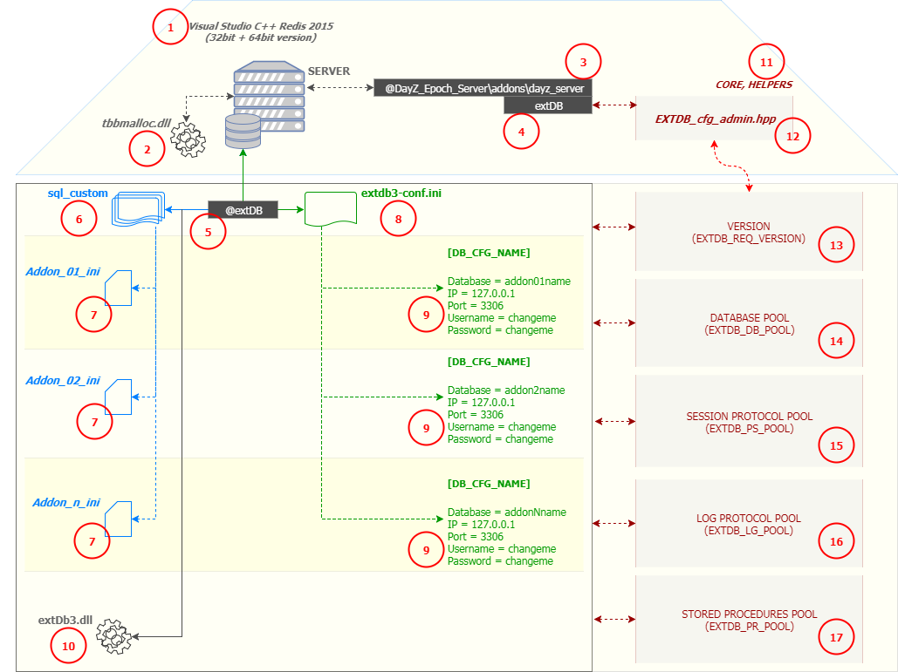

# extDB - Distribution pack for Dayz Epoch modders

**Addon for Connecting to MariaDB/MySQL Databases (distribution for A2 dayzEpoch 1.0.6.2+)**

---

> **Distribution Last update [2017-11-23], v0.1 || extDB version: extDB3 [1032] ||** ([see changelog](#changelog))
> **STATUS: WIP** (todo: readme, helper function introduction, reconnection string in case of connection failure, enhanced security model (randomize connection protocol ID's - storing to uiNamesapce...etc))

---

## Credits

> **extDB3 Author: Bryan "Tonic" Boardwine AKA @Torndeco**

+ Addon original source files: [Bitbucket][bitbucketsrc]
+ Addon Wiki: [Wiki][bitbucketwiki]
+ Addon forum thread: [BIS Forum Thread][bisthread]
+ Addon licence ([**Read licence**][bitbucketlicence])

> **Virtual Garage: Addon (serverside files) used for test implementation - version by @oiad AKA salival**

+ Addon original source files: [Github][vgsrc]
+ Addon forum thread [Epoch Forum Thread][vgthread]

> **DayZ Epoch Mod: Developers, Collaborators, Contributors and Community**

+ Mod original source files: [Github][epochsrc]
+ Mod official forum: [Epoch Forum][epochforum]

---

## TOC

<!-- MarkdownTOC -->

- [Introduction](#introduction)
- [Visual Overview for Noobs](#visual-overview-for-noobs)
- [Installation Checklist for SERVER OWNERS](#installation-checklist-for-server-owners)
- [Installation Checklist for ADDON DEVELOPERS](#installation-checklist-for-addon-developers)
- [Details:](#details)
  - [How to prepare `@extDB` configuration files?](#how-to-prepare-extdb-configuration-files)
  - [How to prepare `dayz_server` files?](#how-to-prepare-dayz_server-files)
  - [Putting all together: Virtual Garage Case Study](#putting-all-together-virtual-garage-case-study)
- [TIPS](#tips)
  - [TIP 01: Use power of stored root path](#tip-01-use-power-of-stored-root-path)
  - [TIP 02: Use debug options](#tip-02-use-debug-options)
- [Changelog](#changelog)

<!-- /MarkdownTOC -->

---

<a name="introduction"></a>
## Introduction

**@ todo:**

+ [ ] A few words (focus group, minimum knowledge)
+ [ ] Available fnc for extDB communication (description, params, examples + enhanced log options)

---

<a name="visual-overview-for-noobs"></a>
## Visual Overview for Noobs



_When you see **[number]** in the text bellow, check the [number] in this visual overview for better context understanding..._

---

<a name="installation-checklist-for-server-owners"></a>
## Installation Checklist for SERVER OWNERS

- [x] [Visual Studio C++ Redistributable 2015][visualredis] **[1]** is available for server.
- [x] Original `tbbmalloc.dll` library **[2]** was replaced by the one provided in this distribution and was copied into Arma server root. ([Which `tbbmalloc.dll` do you mean](arma_server_root/)?)
- [x] `@extDB` addon **[5]** is in the Arma server root. ([Where is `@extDB` addon](arma_server_root/)?)
- [x] `@extDB` addon was added to **launcher parameters** ( i.e. `@extDB;@DayZ_Epoch;@DayZ_Epoch_Server` for Dayz Epoch, or `@extDB;@DayzOverwatch;@DayZ_Epoch;@DayZ_Epoch_Server` for Overpoch).<br> **Do NOT use `@extDB3` folder name (just `@extDB`), or dayz launcher will not recognize the addon and your server will NOT be listed!** ([Where can I test if DZLauncher is able to recognize my server](http://dz.launcher.eu/check)?)
- [x] Addon using `@extDB` was configured - **Follow instructions provided by addon author!**

---

<a name="installation-checklist-for-addon-developers"></a>
## Installation Checklist for ADDON DEVELOPERS

- [x] `@extDB` files are configured **[5] - [9]**.<br>([How to prepare `@extDB` configuration files?](#how-to-prepare-extdb-configuration-files))
- [x] `dayz_server` files are configured **[11] - [17]**, `@extDB` is initiated in server functions **[3]**.<br>([How to prepare `dayz_server` files?](#how-to-prepare-dayz_server-files))
- [x] I've already read chapter [Installation Checklist for SERVER OWNERS (USERS)](#installation-checklist-for-server-owners-users).
- [x] I've already read [`extDB3` licence][bitbucketlicence]

---

<a name="details"></a>
## Details:

<a name="how-to-prepare-extdb-configuration-files"></a>
### How to prepare `@extDB` configuration files?

+ **Prerequisities**: [`extdb3-conf.ini`][EXTDB-conf-ini], [`yourAddonName-conf.ini`][EXTDB-addon-conf-ini] _(vg-conf.ini used as an example)_, addon related files

1. _"Define your database"_ - [`extdb3-conf.ini`][EXTDB-conf-ini] (**[8]/[9]**)

```ini
; ---------------------------------------------------------------------------
; Default database for Dayz Epoch
[epoch]
IP = 127.0.0.1
Port = 3306
Username = changeme
Password = changeme
Database = epoch

; ---------------------------------------------------------------------------
; Separate database for your addon
[my_database1]
IP = 127.0.0.1
Port = 3306
Username = changeme
Password = changeme
Database = my_database1

; ---------------------------------------------------------------------------
; ...additional databases goes bellow if needed...
```

---

2. _"Define `CUSTOM_SQL` settings and prepared statements / procedures for your addon"_ - [`yourAddonName-conf.ini`][EXTDB-addon-conf-ini] (**[6]/[7]**)

+ For more information about **`SQL_CUSTOM` ini** format [visit extDB3 wiki][bitbucketsqlcustom]

```ini
; ---------------------------------------------------------------------------
; Virtual Garage example

; ---------------------------------------------------------------------------
[Default]

Version = 1
Strip Chars = "[]\/\|;{}<>\'"
Strip Chars Mode = 0
Input SQF Parser = false
Number of Retrys = 5

; ---------------------------------------------------------------------------
[RemoveOldVG]
Prepared Statement = false

SQL1_1 = CALL RemoveOldVG;

; ---------------------------------------------------------------------------
[queryVehicle]

SQL1_1 = SELECT id, classname, Inventory, CharacterID, DateStored FROM garage WHERE PlayerUID=? ORDER BY DisplayName;

SQL1_INPUTS = 1
OUTPUT = 1,2-STRING,3,4,5-STRING

; ---------------------------------------------------------------------------
[spawnVehicle]
SQL1_1 = SELECT classname, CharacterID, Inventory, Hitpoints, Fuel, Damage, Colour, Colour2 FROM garage WHERE ID=?;

SQL1_INPUTS = 1
OUTPUT = 1-STRING,2,3,4,5,6,7-STRING,8-STRING

; ---------------------------------------------------------------------------
[storeVehicle]

SQL1_1 = INSERT INTO garage
SQL1_2 = (PlayerUID, Name, DisplayName, Classname, DateStored, CharacterID, Inventory, Hitpoints, Fuel, Damage, Colour, Colour2)
SQL1_3 = VALUES(?,?,?,?,?,?,?,?,?,?,?,?);

SQL1_INPUTS = 1,2,3,4,5,6,7,8,9,10,11,12

; ---------------------------------------------------------------------------
[deleteVehicle]

SQL1_1 = DELETE FROM garage WHERE ID=?;

SQL1_INPUTS = 1

```

---
<a name="how-to-prepare-dayz_server-files"></a>
### How to prepare `dayz_server` files?

+ This will expects your addon server-side files are set
+ **Prerequisities**: [`extdb3-conf.ini`][EXTDB-conf-ini], [`EXTDB_cfg_admin.hpp`][EXTDB-cfg-admin], optional - [stored MySQL procedure(s)][stored-procedure]

1. _"Enable your database"_ - [define][EXTDB-conf-ini] and include your database into database pool - [`EXTDB_DB_POOL`][EXTDB-cfg-admin] (**[12]/[14]**)

```hpp
// ["database_cfg_name","database_name_alias"]
// ---
// "database_cfg_name"    : What's the name of your database? : "my_database1", "my_database2"
// "database_name_alias"  : Any string (friendly name for you) - used in log (so you don't need to use your real database name)
// ---

#define EXTDB_DB_POOL [ \
   ["my_database1","aliasName1"] \
  ,["my_database2","aliasName2"] \
]

// Important: Keep '#define' format, mainly '\' at the end of line (except the last one), otherwise parsing will fail!
```

2. _"Enable ability to talk to your database"_ - define and include session `SQL_CUSTOM` protocol - [`EXTDB_PS_POOL`][EXTDB-cfg-admin] (**[12]/[15]**)

```hpp
// ["database_cfg_name","unique_SQL_CUSTOM_procol_name","addon-conf.ini","protocol_name_alias"]
// ---
// "database_cfg_name"              : The same name as in step 1 : "my_database1", "my_database2"
// "unique_SQL_CUSTOM_procol_name"  : Give the protocol unique name so we can use it for identification : "myProtocol111", "myProtocol222", "myProtocol333"
// "addon-conf.ini"                 : see [7]
// "protocol_name_alias"            : Any string (friendly name for you) - used in log (so you don't need to use your real name ID)
// ---

#define EXTDB_PS_POOL [ \
   ["my_database1","myProtocol111","addon1-conf.ini","protocolAlias1"] \
  ,["my_database1","myProtocol222","addon2-conf.ini","protocolAlias2"] \
  ,["my_database2","myProtocol333","addon3-conf.ini","protocolAlias3"] \
]

// Important: Keep '#define' format, mainly '\' at the end of line (except the last one), otherwise parsing will fail!
// Note: You can define protocol for already existing database (scenario: you didn't create new database, just new table for existing one)
```

3. Optional: _"Enable ability to receive exclusive log"_ - define and include session [`LOG` protocol](preview/addon_exclusive_logfile_example.txt) - [`EXTDB_LG_POOL`][EXTDB-cfg-admin] (**[12]/[16]**)

```hpp
// ["database_cfg_name","unique_LOG_procol_name","unique_logfile_name"]
// ---
// "database_cfg_name"       : The same name as in step 1 : "my_database1", "my_database2"
// "unique_LOG_procol_name"  : Give the protocol unique name so we can use it for identification : "myLOGProtocol111", "myLOGProtocol222", "myLOGProtocol333"
// "unique_logfile_name"     : Choose the name for your logfile (`logs\Y\M\D\logfile.log`): "addon1log", "addon2log", "addon3log"
// ---

#define EXTDB_PS_POOL [ \
   ["my_database1","myLOGProtocol111","addon1log"] \
  ,["my_database1","myLOGProtocol222","addon2log"] \
  ,["my_database2","myLOGProtocol333","addon3log"] \
]

// Important: Keep '#define' format, mainly '\' at the end of line (except the last one), otherwise parsing will fail!
// Note: You can define multiple types of logs for your addon, i.e. "SPECIALTRADING", "VIRTUALGARAGE" etc.
```

4. Optional: _"Enable to run your stored procedures on server start/restart"_ - [create][stored-procedure] and include stored procedure(s) - [`EXTDB_PR_POOL`][EXTDB-cfg-admin] (**[12]/[17]**)

```sql
-- Example scenario: let's say you want to create procedure for removing virtual garage vehicles older then 35 days
-- and you want to run this procedure each restart (info: alternative - events).
-- Remember: running on server start/restart is one option - you can use it dynamically if needed.

-- Create procedure using bellow code:
DROP PROCEDURE IF EXISTS `RemoveOldVG`;
DELIMITER ;;
CREATE PROCEDURE `RemoveOldVG`()
COMMENT 'Removes old Virtual Garage Vehicles'
BEGIN
  DELETE FROM
    `garage`
  WHERE `DateStamp` < DATE_SUB(CURRENT_TIMESTAMP, INTERVAL 35 DAY);
END
;;

-- ...additional procedures goes bellow...
```

```hpp
// Once you stored "RemoveOldVG" procedure, continue with 'EXTDB-cfg-admin' file:

// ["callType","SQL_CUSTOM_procol_name_from_step2_above","stored_procedure_name","procedure_alias"]
// ---
// "callType"                                 : Mostly you want to use type 1 : For more information visit extDB3 wiki...
// "SQL_CUSTOM_procol_name_from_step2_above"  : Already defined 'SQL_CUSTOM' session protocol for your addon : i.e. "myProtocol111"
// "stored_procedure_name"                    : Procedure config name as was defined in your addon config [7]
// "procedure_alias"                          : Any string (friendly name for you) - used in log (so you don't need to use your real procedure ID)
// ---

#define EXTDB_PR_POOL [ \
   [1,"myProtocol111","RemoveOldVG","VG Cleanup"]
]

// Important:
// - Keep '#define' format, mainly '\' at the end of line (except the last one), otherwise parsing will fail!
// - Do not forget set 'Prepared Statement = false' for stored procedures in addon's config file [7]
```

5. _"Initiate `extDB` engine_: Open [`server_functions.sqf`][server_fncs] and insert line: (**[3]**)

```sqf
call compile preprocessFileLineNumbers "\z\addons\dayz_server\extDB\EXTDB_init.sqf";
```

---

6. Now you can use **`extDB`** engine in your addon - see VG addon implementation example bellow:

```sqf
// ---------------------------------------------------------------------------
// :: Query vehicle
_result = [2,"VGAR",(format ["queryVehicle:%1",_playerUID])] call EXTDB_fnc_APICall;

// ---------------------------------------------------------------------------
// :: Store vehicle
_locTime = [] call EXTDB_fnc_getLocalTime;
_displayName = ((getText(configFile >> "cfgVehicles" >> _class >> "displayName")) call EXTDB_fnc_sanitize);

_query = format [
   "storeVehicle:%1:%2:%3:%4:%5:%6:%7:%8:%9:%10:%11:%12"
  ,_playerUID,_name,_displayName,_class,_dateFormat,_charID,_inventory,_array,_fuel,_damage,_colour,_colour2
];
_null = [1,"VGAR",_query] call EXTDB_fnc_APICall;

// ---------------------------------------------------------------------------
// :: Spawn vehicle
_result = [2,"VGAR",(format ["spawnVehicle:%1",_id])] call EXTDB_fnc_APICall;
_null = [1,"VGAR",(format ["deleteVehicle:%1",_id])] call EXTDB_fnc_APICall;

// ---------------------------------------------------------------------------
// :: Exclusive log
  _m = format[
     "GARAGE: %1 (%2) retrieved %3 @%4 %5"
    ,if (alive _player) then {name _player} else {"DeadPlayer"},getPlayerUID _player,_class,mapGridPosition (getPosATL _player),getPosATL _player
  ];
  _null = ["server_spawnVehicle","VIRGA",_m] call EXTDB_fnc_callEXTLog;
```

---

7. For more info see section [**Tips**](#tips)

---

<a name="putting-all-together-virtual-garage-case-study"></a>
### Putting all together: Virtual Garage Case Study

**Goal:**

+ Update old `extDB` to version **`extDB3`**;
+ Change current exclusive **`extDB`** VG implementation to "shared mode", so other modders can benefit from it;
+ Enhance VG code security by switching from raw sql statements to config prepared statements;
+ Use default epoch hive calls only if it's neccessary;
+ Write VG log activity into separate logfile for better overview (prevent "missed in RPT mess");

**Prerequisities:**

+ **Virtual Garage addon** already installed - only [`server-side files`][vgsrc-serveside] are needed for upgrade;
+ **extDB3 addon - Distribution pack for Dayz Epoch modders** - this repo/[`arma_server_root`](arma_server_root/).

**Starting Point**

+ Virtual Garage is using default epoch database - table `garage`;
+ We are working in the local testing env (localhost).

**Step by Step**

<p align="center">--- (01) ---</p>

- **Prepare files for upgrade**
  - [x] Download this repository - save it to your desktop;

<p align="center">--- (02) ---</p>

- **Configure `@extDB` addon**
  - [x] Open [`arma_server_root/@extDB/extdb3-conf.ini`][EXTDB-conf-ini];
  - [x] Fill info about your "epoch database":

```ini
; Note: [vehicle_manager] is your CONFIG DATABASE NAME you are gonna use across all further steps.
;       It doesn't have to be the same as 'Database = database_name'!
; ---------------------------------------------------------------------------
[vehicle_manager]

IP = 127.0.0.1
Port = 3306
Username = vehmng
Password = N507HluCoX
Database = vehicle_manager
```

- [x] Open [`arma_server_root/@extDB/sql_custom/vg-conf.ini`][EXTDB-addon-conf-ini];

```ini
; In this file are stored all procedures and prepared statements used across VG server-side files.
; If you will use procedure 'RemoveOldVG', remember - procedure has to already exists in your database (see 'How to prepare `dayz_server` files?' / 4).
; ---------------------------------------------------------------------------
[RemoveOldVG]
Prepared Statement = false

SQL1_1 = CALL RemoveOldVG;
```

- **Copy `@extDB` related files into arma server root**
  - [x] From [`arma_server_root`](arma_server_root/) copy to you arma server root: (1) folder **`@extDB`** _(modifications are already done from previous step)_; (2) **`tbbmalloc.dll`** _(old one has to be replaced)_;

<p align="center">--- (03) ---</p>

- **Configure `@Dayz_Epoch_Server` addon - `extDB` config**
  - [x] Open [`arma_server_root/@DayZ_Epoch_Server/addons/dayz_server`](arma_server_root/@DayZ_Epoch_Server/addons/dayz_server/) folder;
  - [x] Configure `extDB` server files: open [`EXTDB-cfg-admin.hpp`][EXTDB-cfg-admin] file and fill bellow info;
  - [x] When you're done, copy whole folder **`extDB`** to your local arma server root, so path will look like:<br>`arma server root/@DayZ_Epoch_Server/addons/dayz_server/extDB`.

```hpp
// :: (A) Add your database info into pool
// :: ["database_cfg_name","database_name_alias"]
// ---------------------------------------------------------------------------
#define EXTDB_DB_POOL [ \
   ["vehicle_manager","myCodeNameForDB"] \
]

// :: You can delete rest of definitions in the file you don't need (it's just an example there)
```

```hpp
// :: (B) Define VG specific 'SQL_CUSTOM' session protocol
// :: ["database_cfg_name","unique_SQL_CUSTOM_procol_name","addon-conf.ini","protocol_name_alias"]
// ---------------------------------------------------------------------------
#define EXTDB_PS_POOL [ \
   ["vehicle_manager","VGAR","vg-conf.ini","Garage"] \
]

// :: You can delete rest of definitions in the file you don't need (it's just an example there)
```

```hpp
// :: (C) Define VG specific 'LOG' session protocol
// :: ["database_cfg_name","unique_LOG_procol_name","unique_logfile_name"]
// :: VG logs will be stored : 'arma_root/@extDB/YEAR/MONTH/DAY/virtual_garage.log'
// ---------------------------------------------------------------------------
#define EXTDB_LG_POOL [ \
   ["vehicle_manager","VIRGA","virtual_garage"] \
]

// :: You can delete rest of definitions in the file you don't need (it's just an example there)
```

```hpp
// :: (D) In case you created any stored procedure(s), set your execution request here (otherwise leave it alone)
// :: ["callType","SQL_CUSTOM_procol_name_from_above","stored_procedure_name","procedure_alias"]
// ---------------------------------------------------------------------------
#define EXTDB_PR_POOL [ \
   [1,"VGAR","RemoveOldVG","VG Cleanup"] \
]

// :: You can delete rest of definitions in the file you don't need (it's just an example there)
```

- **Configure `@Dayz_Epoch_Server` addon - initiate `extDB` engine**
  - [x] Open `server_functions.sqf` and add bellow line ([you can see example here...][server_fncs]).

```sqf
call compile preprocessFileLineNumbers "\z\addons\dayz_server\extDB\EXTDB_init.sqf";
```

- **Upgrade Virtual Garage server-side files**
  - [x] Open `@Dayz_Epoch_Server/addons/dayz_server/compile/garage` folder.
  - [x] Remove `fn_async.sqf` file.
  - [x] Replace rest of files with [**`files from this repo`**][vgcompiles], or merge them using diff tool.
  - [x] When you're done, pack and copy whole folder **`@Dayz_Epoch_Server`** to your local arma server root, so path will look like:<br>`arma server root/@DayZ_Epoch_Server/`.

<p align="center">--- (04) ---</p>

- **That's pretty much it!**
  - [x] As the last step go to section [**`Installation Checklist for SERVER OWNERS`**](#installation-checklist-for-server-owners)
  - [x] See section [**Tips**](#tips)
  - [ ] **_Enjoy..._**

---

<a name="tips"></a>
## TIPS

<a name="tip-01-use-power-of-stored-root-path"></a>
### TIP 01: Use power of stored root path

> You can move [**`day_server\extDB`**](arma_server_root/@DayZ_Epoch_Server/addons/dayz_server/extDB/) wherever you like without changing paths.

Root path is autodiscovered on init and stored into **`EXTDBROOT`** variable. If you will need to add your custom helper functions - all you need to do is just use it (see [**`EXTDB_init.sqf`**](arma_server_root/@DayZ_Epoch_Server/addons/dayz_server/extDB/EXTDB_init.sqf)).

<a name="tip-02-use-debug-options"></a>
### TIP 02: Use debug options

> Before you push your addon to live server, stay a little while with your test server and get the most info you can get:

+ **Test your protocols, queries etc. using console - no need to go online with Arma!**
  + [x] Open [**`debug_files`**](debug_files/) folder and copy to your **local arma server root**:
    + [x] **`extdb3-conf.ini`:** Make sure it already has correct info.
    + [x] **`extDB3.dll`**
    + [x] **`extDB3-test.exe`**
  + [x] Replace original **`tbbmalloc.dll`** library **[2]** in **local arma server root** by [the one provided in this distribution](arma_server_root/).
  + [x] Open [**`arma_server_root/@extDB`**](arma_server_root/@extDB/) folder and, again, copy whole folder **`sql_custom`** to your **local arma server root**:
    + [x] Open it in your editor for later - you will write your stored procedures in there (and test them in console...)
  + [x] That's it. Now you can start console from your local arma server root and run **`extDB3-test.exe`**.
    + [x] **Important:**
      + [x] Remember: as a minimum, you need to connect to database and create session protocol to be able to talk to database.
      + [x] When you're testing, you will need to reset connection from time to time (using system command **`"9:RESET"`** - mostly when you change your SQL code inside **`sql_custom`** folder) - Do not forget set **`Allow Reset = true`** in **`extdb3-conf.ini`** (We are still in arma server root, right?).
      + [x] As a start, you can check [**`this debug console system commands test file`**](preview/SYSTEM_debug_console_test_examplet.txt) and [**`this general call types info file`**](preview/GENERAL_call_types.txt)
+ **Get trace level debug info in live game using debug DLL**
  + [x] Copy **`extDB3.dll`** from [**`debug_files`**](debug_files/) and replace the original one in [**`@extDB`**](arma_server_root/@extDB/).
  + [x] [**`See the log example`**.](preview/debug_dll_log_example.txt).
  + [x] **Important:** do not use this dll on your live server (there is a performace hit)...

+ **Get detailed info about `extDB` engine initialization**
  + [x] If you wish enable handy debug RPT info (...or on screen debug info where applicable), make sure these definitions are uncommented:
    + [x] **`#define __ROOTDBG__`** - prints autodiscovered addon root path to RPT ([**`Where is it?`**](arma_server_root/@DayZ_Epoch_Server/addons/dayz_server/extDB/core/helpers/EXTDB_cfg_format.hpp))
    + [x] **`#define __EXTDBGEN__`** - prints debug info to RPT (results, params errors etc.) ([**`Where is it?`**](arma_server_root/@DayZ_Epoch_Server/addons/dayz_server/extDB/core/helpers/EXTDB_cfg_format.hpp))
    + [x] **`#define __EXTDBINT__`** - prints debug info to RPT + on screen info (systemChat) ([**`Where is it?`**](arma_server_root/@DayZ_Epoch_Server/addons/dayz_server/extDB/core/helpers/EXTDB_fnc_callDebugLog.sqf))
  + [x] See bellow how RPT log looks like when **`#define __ROOTDBG__`** and **`#define __EXTDBGEN__`** are enabled:<br>**Scenario:** We are initiating `2x databases`; `3x session protocols`; `2x log protocols` (no error mode)
  + [x] [**`See more debug outputs in different scenarios`**](preview/RPT_log_info_onInit_examples.txt)

```ini
// ---------------------------------------------------------------------------
// RPT log:
10:47:53 "=== [EXTDB, [EXTDB_init]] || DEBUG :: [EXTDB_fnc_init_ROOTer] >> Addon relative root >> [z\addons\dayz_server\extDB]"
10:47:53 "=== [EXTDB, [SYSTEM]] || DEBUG :: [EXTDB_connect] >> Connection procedure initiated..."
10:47:53 "=== [EXTDB, [SYSTEM]] || DEBUG :: [EXTDB_connect] >> INFO >> DB pool processing started..."
10:47:53 "=== [EXTDB, [SYSTEM]] || DEBUG :: [EXTDB_connect] >> INFO >> Connection to database [0-myCodeNameForDB1] set."
10:47:53 "=== [EXTDB, [SYSTEM]] || DEBUG :: [EXTDB_connect] >> INFO >> Connection to database [1-myCodeNameForDB2] set."
10:47:53 "=== [EXTDB, [SYSTEM]] || DEBUG :: [EXTDB_connect] >> INFO >> PS pool protocol started..."
10:47:53 "=== [EXTDB, [SYSTEM]] || DEBUG :: [EXTDB_connect] >> INFO >> Session protocol [0-Garage] set."
10:47:53 "=== [EXTDB, [SYSTEM]] || DEBUG :: [EXTDB_connect] >> INFO >> Session protocol [1-protocolAlias2] set."
10:47:53 "=== [EXTDB, [SYSTEM]] || DEBUG :: [EXTDB_connect] >> INFO >> Session protocol [2-protocolAlias3] set."
10:47:53 "=== [EXTDB, [SYSTEM]] || DEBUG :: [EXTDB_connect] >> INFO >> LOG pool protocol started..."
10:47:53 "=== [EXTDB, [SYSTEM]] || DEBUG :: [EXTDB_connect] >> INFO >> LOG protocol [0-VIRGA] set."
10:47:53 "=== [EXTDB, [SYSTEM]] || DEBUG :: [EXTDB_connect] >> INFO >> LOG protocol [1-NEWAD] set."
10:47:53 "=== [EXTDB, [SYSTEM]] || DEBUG :: [EXTDB_connect] >> INFO >> Locking API..."
10:47:53 "=== [EXTDB, [SYSTEM]] || DEBUG :: [EXTDB_connect] >> INFO >> Result: [2/2] databas(es) connected [3/3] session protocol(s) set [2/2] log protocol(s) set."
10:47:53 "=== [EXTDB, [SYSTEM]] || DEBUG :: [EXTDB_connect] >> INFO >> Connection procedure finished in [0.275002 seconds] with status [1]."
10:47:53 "=== [EXTDB, [SYSTEM]] || DEBUG :: [EXTDB_runDBCleanup] >> INFO >> DB cleaning procedure initiated..."
10:47:53 "=== [EXTDB, [SYSTEM]] || DEBUG :: [EXTDB_runDBCleanup] >> INFO >> Cleaning procedure [0-VG Cleanup] fired..."
10:47:53 "=== [EXTDB, [SYSTEM]] || DEBUG :: [EXTDB_runDBCleanup] >> INFO >> Cleaning procedure finished in [0 seconds] with status [true]."
```

---

<a name="changelog"></a>
## Changelog

| Date         | Version | Description                                                                                                     |
| :---         | :---    | :---                                                                                                            |
| [2017-11-23] | v0.1    | Initial release                                                                                                 |
| [2017-11-28] | v0.2    | Added debug src files;<br>TIP 01: 'Use power of stored root path'; TIP 02: 'Use debug options' - incl. examples |

---

[extdbsource]: https://bitbucket.org/torndeco/extdb3/wiki/Home "Go to source"
[extdbthread]: https://forums.bistudio.com/forums/topic/169723-extdb-arma3-extension-linuxwindows/ "Go to source"
[bitbucketsrc]: https://bitbucket.org/torndeco/extdb3/src "Go to source"
[bitbucketlicence]: https://bitbucket.org/torndeco/extdb3/wiki/Home "Go to source"
[bitbucketwiki]: https://bitbucket.org/torndeco/extdb3/wiki/Contents "Go to source"
[bitbucketsqlcustom]: https://bitbucket.org/torndeco/extdb3/wiki/extDB3%20-%20sql_custom.ini "Go to source"
[bisthread]: https://forums.bistudio.com/forums/topic/169723-extdb-arma3-extension-linuxwindows/ "Go to source"
[vgsrc]: https://github.com/oiad/virtualGarage/tree/master/dayz_server "Go to source"
[vgsrc-serveside]: https://github.com/oiad/virtualGarage/tree/master/dayz_server/compile/garage "Go to source"
[vgthread]: https://epochmod.com/forum/topic/44280-release-virtual-garage-for-1061/ "Go to source"
[epochsrc]: https://github.com/EpochModTeam/DayZ-Epoch "Go to source"
[epochforum]: https://epochmod.com/forum/ "Go to source"
[visualredis]: https://www.microsoft.com/en-us/download/details.aspx?id=48145 "Go to source"
[EXTDB-cfg-admin]: arma_server_root/@DayZ_Epoch_Server/addons/dayz_server/extDB/core/helpers/EXTDB_cfg_admin.hpp "Go to source"
[EXTDB-conf-ini]: arma_server_root/@extDB/extdb3-conf.ini "Go to source"
[EXTDB-addon-conf-ini]: arma_server_root/@extDB/sql_custom/vg-conf.ini "Go to source"
[server_fncs]: arma_server_root/@DayZ_Epoch_Server/addons/dayz_server/init/server_functions.sqf "Go to source"
[stored-procedure]: SQL/new_addon_test_procedure.sql "Go to source"
[vgcompiles]: arma_server_root/@DayZ_Epoch_Server/addons/dayz_server/compile/garage/ "Go to source"
